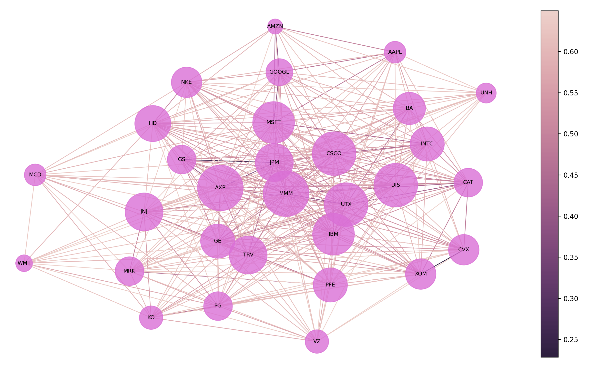

# Minimal Correlation Portfolio

This project is a portfolio selection algorithm that addresses some of the shortcomings of the efficient frontier model of modern portfolio theory (MPT). The algorithm is designed to handle historical time series of unequal dimensions and detect non-linear associations between assets, enabling optimization across asset classes with sparse data.

# Usage

First, it necessary to collect the relevant data for the candidate stocks in consideration by running `data_collector.py`. This will collect OHLC data from Yahoo and store it in the `data` directory in an individual file for each symbol. Additionlly, a file is created in the root directory which collates the data for each symbol into a singular file. The stocks for which data is collected are stored in a list in the `stocks.py` file.

Then run the scripts from the terminal with

```
python3 {filename}.py
```

For example
```
python plot_correlation_network.py
```

will plot a time series correlation network using the data in the repository.



In the above visualization, the sizes of the vertices are proportional to the number of connections they have. The colorbar to the right indicates the degree of disimilarity (the distance) between the stocks. The larger the value (the lighter the color) the less similar the stocks are.

## Preprocessing the data

### Exploratory Data Analysis and Cleaning
Before we dive into the meat of our asset allocation model, we first explore, clean, and preprocess our historical price data for time-series analyses. In this section we complete the following.

- Observe how many rows and columns are in our dataset and what they mean.
- Observe the datatypes of the columns and update them if needed.
- Take note of how the data is structured and what preprocessing will be necessary for time-series analyses.
- Deal with any missing data accordingly.

## Building an Asset Correlation Network

Once that the data is preprocessed we can start thinking our way through the below problem creatively.

Given the  assets in our portfolio, find a way of computing the allocation weights ,  such that assets more correlated with each other obtain lower weights while those less correlated with each other obtain higher weights.

One way of tackling the above is to think of our portfolio as a weighted graph. Intuitively, a graph captures the relations between objects – abstract or concrete. Mathematically, a weighted graph is an ordered tuple  where  is a set of vertices (nodes),  is the set of pairwise relationships between the vertices (edges), and  is a set of numerical values assigned to each edge.

A useful represention of  is the adjacency matrix:

<div align="center"></div>
<div align="center"></div>

Here the pairwise relations are expressed as the  entries of an  matrix where  is the number of nodes. In what follows, the adjacency matrix becomes a critical instrument of our asset allocation algorithm. **Our strategy is to transform the historical pricing data into a graph with edges weighted by the correlations between each stock.** Once the time series data is in this form, we use graph centrality measures and graph algorithms to obtain the desired allocation weights. To construct the weighted graph we adopt the winner-take-all method presented by [Tse, *et al*. (2010)](http://cktse.eie.polyu.edu.hk/pdf-paper/JoEF-1009.pdf) with a few modifications. (See [Stock Correlation Network](https://en.wikipedia.org/wiki/Stock_correlation_network) for a summary.) Our workflow in this section is as follows.

1. Compute the distance correlation matrix  for the `Open`, `High`, `Low`, `Close`, and `Close_diff` time series.

2. Use the NetworkX module to transform each distance correlation matrix into a weighted graph.

3. Adopt the winner-take-all method and remove edges with correlations below a threshold value of 

<div align="center"></div>
<div align="center"></div>

A threshold value of 0.325 is arbitrary. In practice, the threshold cannot be such that the graph is disconnected, as many centrality measures are undefined for nodes without any connections.

4. Inspect the distribution of edges (the so-called degree distribution) for each network. The degree of a node is simply the number of connections it has to other nodes. Algebraically, the degree of the ith vertex is given as,

<div align="center"></div>

5. Build a master network by averaging over the edge weights of the `Open`, `High`, `Low`, `Close`, and `Close_diff` networks and derive the asset weights from its structure.

# Dependencies

A comprehensive list of current dependencies include the following libraries

```
Pandas (data manipulation)
Numpy (scientific computing)
Scipy (statistical computing)
dcor (energy statistics)
NetworkX (graph analytics)
Matplotlib (plotting)
Seaborn (plotting)
pypfopt (portfolio optimization)
datetime (dates & times)
```
# Context

## Wrestling with Imperfect Data

By selecting assets whose pairwise correlations are minimal, in theory, an optimal allocation that yields superior risk-adjusted returns can be obtained. The difficulty of this approach is that the correlations are non-stationary (e.g., see the [Financial 15 Index of South Africa](http://www.turingfinance.com/wp-content/uploads/2014/09/financial-fifteen-correlations.png)) and are known to harbor non-linear effects ([Haluszczynski, 2017](https://arxiv.org/pdf/1712.02661.pdf); [Hsieh, 1995](https://faculty.fuqua.duke.edu/~dah7/faj1995.pdf)). To make matters worse financial data is incredibly sparse. While there's plenty of historical data for stocks, the same can't be said, for example, of fixed income or alternative assets. In practice, and more often than not, quantitative analysts face the problem of estimating correlations between time series of unequal dimension.

There are two types of missing data in financial time series: periodically missing values and entirely missing trajectories (i.e. time series that end abruptly). In the case where most of the assets have missing trajectories, and hence replacing their missing values becomes a problem of forecasting. Pearson's correlation coefficient is of no help here since it:
- only captures linear associations in the data,
- only works for time series of equal dimension.

## A Network-based Approach

There's been accumulating evidence that asset correlation networks follow a power-law degree distribution, which roughly means only a few nodes are weakly correlated with the rest of the network ([Tse, et al. 2010](http://cktse.eie.polyu.edu.hk/pdf-paper/JoEF-1009.pdf); [Boginski, et al. 2005](https://www.sciencedirect.com/science/article/pii/S0167947304000258)). An asset correlation network is a graph whose nodes are assets and whose edges are the pairwise correlations between the assets' historical time series (usually taken as the daily closing prices or logarithmic returns). The emergence of complex networks and the study of their fundamental organizing principles have garnered significant attention from the scientific community, large in part from the seminal works of Albert Barabasi that show most of these networks are governed by simple "scale-free" laws. Forecasting financial time series is known to be [notoriously difficult](https://towardsdatascience.com/3-facts-about-time-series-forecasting-that-surprise-experienced-machine-learning-practitioners-69c18ee89387), but perhaps forecasting the evolution of asset correlation networks isn't? If asset correlation networks are driven by simple laws, then it's reasonable to assume these laws can be learned by a single ML algorithm (as opposed to learning a model for each time series). What's more, these observations suggest the degree distribution of asset correlation networks are stationary, further suggesting the selected ML model need only be trained once (as opposed to continuously).

## Communicability of Complex Networks

In the case of an asset correlation network, we're interested in how volatility spreads between assets and how we can act on such insights to optimize our portfolio. For example, suppose Apple suddenly loses 40% of its value, wiping out, say, two years of explosive gains. How would this highly volatile event ripple throughout our portfolio? Which of our assets would bear the brunt of the impact? Which would parry it unscathed? To this end, the aim would be to build a portfolio selection algorithm that can ingest imperfect data, anticipate changes in an asset correlation network, and predict how volatility propagates asset to asset.
